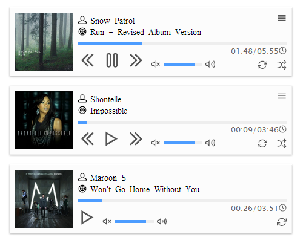
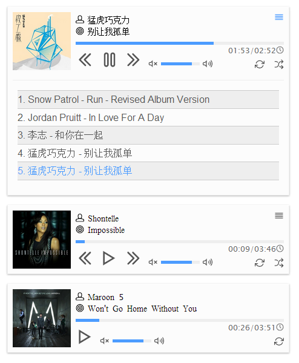

#Mplayer

This is a jQuery plugin that support audio playing in the modern broswer. With this framework you can easily create multi-player in your website page, and support single or multi-audio.

The Mplayer has lots of Opening APIs, it lets developer more easier to play audios in the broswer and have full control of it.

Created by serenader in 2014/6 updated in 2014/7.


----
##ScreenShot


Player that with no playlist displayed.



Player that with playlist.


----
##Basic usage

The simplest example is like this:

```
<!DOCTYPE html>
<html lang="en">
<head>
    <meta charset="UTF-8">
    <title>Mplayer</title>
    <link rel="stylesheet" href="css/style.css">
    <script src="path/to/the/jquery.js" type="text/javascript"></script>
    <script src="js/mplayer.js" type="text/javascript"></script>
</head>
<body>
    <div class="player"></div>
    <script>
        var player = $(".player").Mplayer().initialize([
            "http://example.com/some/mp3/file.mp3",
            "http://example.com/some/mp3/file2.mp3",
            "http://example.com/some/mp3/file3.mp3",
            {
                title: "Example",
                artist: "Artist",
                mp3: "path/to/file.mp3",
                ogg: "path/to/file.ogg",
                cover: "path/to/cover.jpg"
            }
            ])
    </script>
</body>
</html>
```
The code above will create a Mplayer instance.

-----
##Advance config

The way to create a Mplayer instance is calling the `Mplayer()` method behind a jQuery object, like this `$("element").Mplayer()` . This code shows how to create an instance. It is easy, doesn't it?

And after created an instance, you must pass a playlist to the `initialize()` method. The `Mplayer` object support chaining method. So after you called the `Mplayer()` method, you can continue call another Mplayer method.

So we create a player, and what we have to do is giving a playlist. Even a single audio.

Storing the audio list in an Array. Such as `["this is an example.mp3","another example.mp3"]`.

You might notice that the example code above using an Object to create a single audio, yes, the playlist support two kinds of format. 
You can pass a string that contains an audio source, like this `"artist - title.mp3"` . The Mplayer will detect the string wheather contains the `-` charactor or not. If not ,it will set this audio's artist to "undefined", and set the title to the string. If contains the `-` charactor, it will split it into two strings and set to the audio's artist and title. 
The another way to pass the audio is using an object. The object must contains the `mp3` or the `ogg` keys. The player will set these keys' value to the player's `src` attribute. So when you use a custom format, please notice this. And you may define the audio's artist and title to what you want.
Here is the important keys that will use in the player:

```
{
    artist: "artist",
    title: "title",
    mp3: "mp3.mp3", //path to the mp3 file
    ogg: "ogg.ogg",//path to the ogg file
    cover: "cover.jpg" //path to the jpg file
}
```
This way of creating audio lets you have full control of your playlist's informations. 

-----
###How it works

HTML5 started to support native Audio/Video , it's not strange. But the HTML5 Audio tag only support one audio in one tag.
So I wonder if there is some way to create a web player that support playlist, using `<audio></audio>` tag.

I began to search the Internet. And I found [jPlayer](https://github.com/happyworm/jPlayer). I have to admit that jPlayer works like a charm! I love it!. And I began to use it. But after a while I started to wonder, can I create a light player that simply support HTML audio ?
So I begin to write a plugin by myself.

So what you see now is a plugin that made by myself, a JavaScript beginner. Now it is just in a *BETA* version, it's very unstable, and everything can be changed in the future. **So if you need a player that has long term support and works fine, with good stablity, you may want jPlayer, not this.**

The way how Mplayer works is dynamic changing the `<audio></audio>`'s `src` attribute, make it possible to support multi audios.
The details to create a player is to create a Mplayer instance, and every instance will have its own playlist, index, and other methods and property. So we can easily control every instance and will not obstruct other instances.


-----
####Method introduction
These methods below can be called in the Mplayer instance. But not all methods will work in all the time. Some methods require some conditions.

* `initilaize(list, css)` : This method only can be called when you are just creating an instance. If you have already called this method to the instance, call it again will throw an error.This method is used to initialize the player, including creating the player's UI and binding the element's event, and all the logic. It accepts two arguments, the first one is the playlist. It must be an array. The playlist's format can be found in above. The second argument is the custom HTML structure. Passing the second argument means that you have already create a set of document element, so the Mplayer plugin won't create the document element again. This is optional. Default is none. The second argument is an object, its format can be found in the *Important property introduction* part. Read it carefully before you passing the second argument. Because it is easy to get wrong, and makes the player don't work.

* `play()` : Calling this method will immediately play the current audio.

* `pause()` : Calling this method will pause the player, if the player is playing.

* `next()` : This method will stop the current audio and play the next audio immediately. When your playlist only have one audio, this method will do nothing. Only if the playlist's length is greater than one, the method will work.

* `prev()` : Similar to the `next()` method. This method will play the previous audio immediately.

* `shuffle` : Calling this method will shuffle the instance's playlist. And it will create a new instance's property `originalList` . When shuffling the playlist, the player will reload the playlist again, and begin to play the first audio in the new playlist. The previous playlist is stored in the `originalList` property. The reason why I created this property is we may use the previous list in our customize.

* `load(i)` : This method accepts a number argument, and will change the current audio to `playlist[i]`. This method will change the current `audio` tag's attribute to a new one, and change the UI's artist and title, also cover.
*This method fixes the bug that mobile phone broswer can't play audio when changing the `src` attribute.*

* `switchTrack(i, isPaused)`: This method accepts two arguments, first one is a number, which is the one that will change to. The second argument is a boolean object. When it is `true` , calling this method will continue playing. Otherwise, it will pause the current audio, and begin playing the new one, which is the first argument. The second argument's purpose is to decide the user's behavious. When you're playing the audio, and you pause it, and want to continue playing, instead of playing it from the beginning, so you must pass `true` to the second argument. If you just want to change to other audio, just pass the number you want. And it will automatic load the new audio's informations and begin playing. Also this will change the current instance's property `currentTrack` to the number.

* `createView` : This one is used to create the UI, it will be excuted when you call `initialize()` method.

* `updatePlaylist` : This method is used to reload the playlist. When you call a `shuffle()` method, this method will be excuted.Also when you use your own HTML structure, it will be excuted and create the playlist, for the custom HTML structure will not contain the playlist part.

* `setProgress(i)` : This method can change the audio's current time to any time that you want. It accepts one argument, which can be a string or a number. Whatever it is a string or a number, it always stands for a time object. When passing a number, it stands for the second that you want to played on. When passing a string, it must contain a *:* charactor. Its format is simply like "1:00". The method will recognize the string and translate it to a second based value. Remember, this method can't work when the `audio` is not ready. So calling this method just after the page loaded won't do anything, instead it will throw an error.

* `setVolume(i)` : Set the instance's volume to the value that you wanted. It accepts one argument, and it must be a number, which arrage is between [0,1]. When you pass a number that is greater than 1, it will throw an error. The same when you pass a argument that is not a number.

* `getCurrentTime()` : Calling this method will return the instance's playing current time. Remember, this method will not return the instance object, so this method will not suppport chaining expression.

* `getDuration()` : Return the current audio's duration. Also this one will not support chaining expression.

* `defaultEventBinding` : When calling `initialize()` method ,this method will be excuted, just like `createView()` method. After initialize the instance, you won't need to call this method again. Because binding event listener multiple time can reduce the web page's performance.

* <del>`eventListener` : This one is similar to `defaultEventBinding`. It will be merged into `defaultEventBinding` method in the future.</del>**Changed in the version 0.2.0.**
* `audioEventListener` : This method is used to adding some listener to the audio element. *Added in the version 0.2.0*


----

####Important property introduction
Each instance will store some important properties. The whole instance use these properties to work correctly.

* `playlist` : This is the most important one. It will store the current instance's audio, sorted as a list, using an array. User can access it using `instance.playlist` . The element inside playlist is object. Every object stands for a audio, it contains a audio's all informations.

* `css` : This one stores the instance's HTML structure. With this property, we are able to use our custom HTML structure, instead of using the default ones. And therefore we can custom the instance's interface, not only CSS, but also HTML. The instance's event binding uses this property's value, so the custom HTML structure we given will also work. This property is an object. All the keys that the player need are :

```
css: {
        player: ".mplayer",
        main: ".mplayer-main",
        playlist: ".mplayer-playlist",
        audio: ".mplayer-audio",
        control: ".mplayer-control",
        play: ".mplayer-btn-play",
        pause: ".mplayer-btn-pause",
        next: ".mplayer-btn-next",
        prev: ".mplayer-btn-prev",
        loop: ".mplayer-btn-noloop",
        singleLoop: ".mplayer-btn-single",
        allLoop: ".mplayer-btn-all",
        shuffle: ".mplayer-btn-shuffle",
        song: ".mplayer-song",
        current: ".mplayer-current",
        cover: ".mplayer-cover",
        title: ".mplayer-title",
        artist: ".mplayer-artist",
        progressBar: ".mplayer-progress",
        playedTime: ".mplayer-played-time",
        volumeBar: ".mplayer-volume",
        volumeValue: ".mplayer-volume-value",
        currentTime: ".mplayer-current-time",
        duration: ".mplayer-duration",
        time: ".mplayer-time",
        mute: ".mplayer-mute",
        maxVolume: ".mplayer-max-volum",
        playlistMenu: ".mplayer-list"
}

```

Above is the default HTML structure.
To use the custom HTML structure is to pass the object like above into the `initialize()` method. For more details please refer to the intro.

* `element`: This property stores the current instance's jQuery object. For example, if you create a Mplayer instance using `$(".test").Mplayer()` , the `instance.element` is set to `$(".test")`. And you can use this property to do a lot things.

* `index` : This property shows the current instance's order in this web page. When you create multi instance in one page, the `index` property can identified these instance.

* `currentTrack` : This property shows the current instance's current audio's order.


-----
###Known issue

<del>1. Mobile phone broswer doesn't work well. Multi audio won't work in my android phone. Haven't test in the iPhone. This will take some times to work out.</del> **Fixed in the version 0.2.0.**

2. You tell me.

-----
###TODO

1. Fix bugs
2. Improve default UI. It's not beautiful and not cool. I'll find some times to rewrite the CSS file.
3. More broswer supported.

-----
###LICENSE

MIT